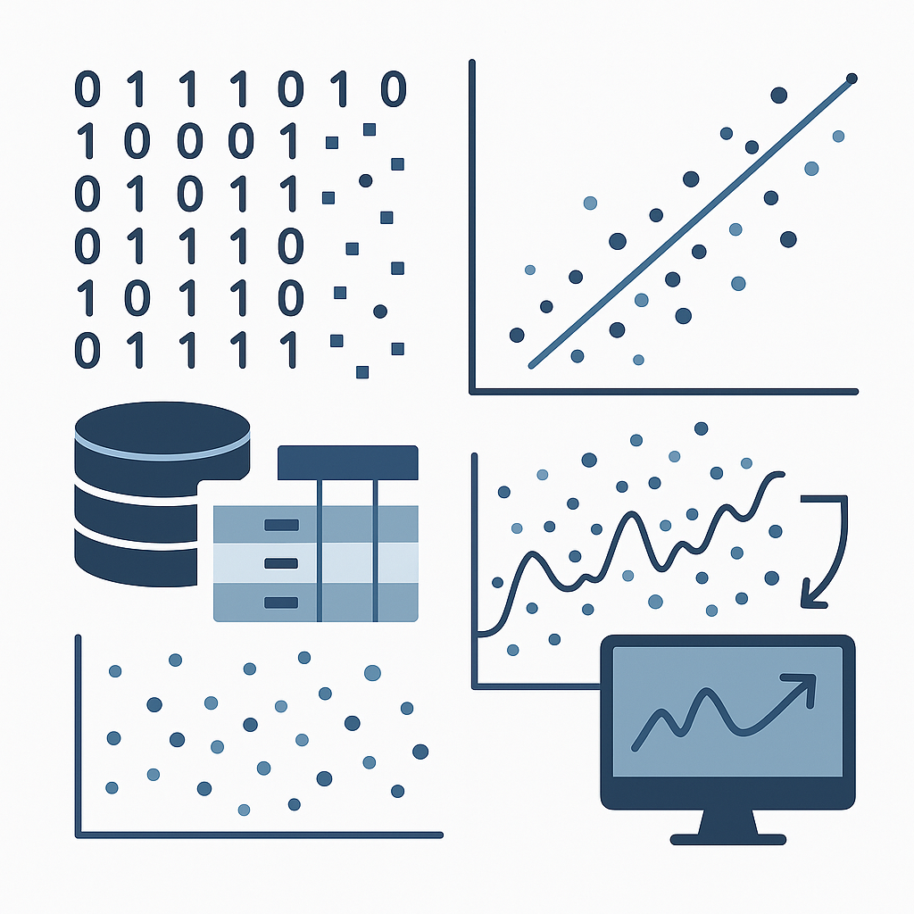

# 👋 Hi, I'm Prashanth Manga  
### 🎯 AI/ML Enthusiast | Future Innovator  
> “Designing intelligent systems that enhance human potential through data-driven insight.”

---

## 🔗 Quick Navigation  
[About Me](#about-me) | [Professional Bio](#professional-bio) | [Skills](#skills--interests) | [Featured Projects](#featured-projects) | [Testimonials](#testimonials) | [Contact](#connect-with-me)

---

## 🧠 About Me  

I’m **Prashanth Manga**, an aspiring **AI/ML Engineer** passionate about merging **data, algorithms, and ethics** to create intelligent systems that serve real-world impact.  
My vision is to build solutions that **enhance learning, improve decisions, and promote responsible AI** across industries.  

📫 **Email:** [mangaprashanth88@gmail.com](mailto:mangaprashanth88@gmail.com)  
🌐 **Portfolio:** [mangaprashanth.github.io](https://mangaprashanth.github.io)  
🐙 **GitHub:** [github.com/mangaprashanth](https://github.com/mangaprashanth)

---

## 💼 Professional Bio  

I am an **AI/ML Enthusiast** dedicated to exploring how data and intelligent systems can drive innovation.  
Through experimentation and collaboration, I aim to design **ethical, explainable, and data-driven** solutions that transform ideas into working prototypes.  
My projects demonstrate my ability to **analyze data**, **build models**, and **communicate complex concepts** clearly and visually.

---

## 🚀 Personal Value Proposition  

> “I bridge creativity and computation — transforming raw data into meaningful intelligence.”  

I combine technical depth with design thinking to build AI systems that are not only functional but **empathetic**, **transparent**, and **impact-focused**.

---

## 🛠️ Skills & Interests  

### 💻 Core Skills

| Skill | Proficiency |
|:------|:-------------|
| **Python** | ⭐⭐⭐⭐☆ |
| **SQL** | ⭐⭐⭐⭐☆ |
| **C++** | ⭐⭐⭐☆☆ |
| **Machine Learning (Scikit-Learn)** | ⭐⭐⭐⭐☆ |
| **Deep Learning (TensorFlow, PyTorch)** | ⭐⭐⭐⭐☆ |
| **Data Visualization (Matplotlib, Seaborn, Power BI)** | ⭐⭐⭐⭐☆ |
| **Cloud Tools (AWS, Google Colab)** | ⭐⭐⭐☆☆ |
| **Version Control (Git, GitHub)** | ⭐⭐⭐⭐☆ |

---

### 🌐 Areas of Interest  

- 🤖 **Generative AI & LLMs**  
- 🧠 **Reinforcement Learning**  
- ☁️ **Cloud-based AI Deployments**  
- 🧩 **AI Ethics & Explainability**

---

## 💡 Featured Projects  

# 🔹 Artifact 1 — Q/A Classroom Assistant Chatbot

## 🏷️ Artifact Title  
**AI-Powered Classroom Q/A Assistant Chatbot (Built on the Mizou Platform)**

## 📝 Introduction  
This artifact showcases an **AI-driven educational chatbot** designed to support students with accurate, syllabus-based Q&A interactions. Built with a strong ethical and empathetic framework, the chatbot focuses on clarity, reliability, and student-centered learning. It demonstrates applying structured design thinking and technical rigor in creating safe, high-quality AI learning tools.

## 📄 Description  
The chatbot is implemented on the **Mizou platform**, leveraging a closed-domain question-answering system grounded strictly in course materials. It is crafted to minimize hallucinations, deliver human-like explanations, and follow an ethics-first interaction approach. This artifact highlights the full lifecycle of solution design, from ideation to implementation and user testing.

## 🎯 Objective  
- Build an **accurate and empathetic Q/A assistant** for students.  
- Ensure **closed-domain reliability** using syllabus-defined materials.  
- Apply **Design Thinking** to balance user experience with technical precision.  
- Reduce hallucination risks through structured content retrieval.

## 🛠️ Process  
### 1. Empathize  
Identified student pain points—unclear explanations, unverified answers, lack of supportive guidance.  

### 2. Define  
Established key constraints: accuracy, safety, empathy, and syllabus-bounded responses.  

### 3. Ideate  
Designed interaction flows, retrieval strategies, and fail-safe behaviors.  

### 4. Prototype  
Developed chatbot logic on Mizou using retrieval policies and behavior guidelines.  

### 5. Test  
Refined through user feedback and Q/A accuracy evaluations, improving clarity and trust.

## ⚙️ Tools and Tech Used  
- **Mizou Chatbot Platform**  
- **Design Thinking Framework**  
- **Closed-domain RAG (Retrieval-Augmented Generation)**  
- **Empathy-driven conversational guidelines**  
- **Structured course content from _Introduction to Machine Learning with Python_**

## 💡 Value Proposition of the Artifact  
- Provides **reliable academic assistance** with reduced hallucinations.  
- Uses empathy-guided responses that enhance student engagement and learning confidence.  
- Offers **explainable AI interactions** aligned with educational ethics.  
- Demonstrates strong product thinking through a complete design-to-delivery pipeline.

## 🌟 Unique Value  
- Combines **Design Thinking + Responsible AI + Closed-domain RAG** into one cohesive educational tool.  
- Follows a **materials-only retrieval policy**, ensuring 100% syllabus alignment.  
- Balances technical depth and human-centered design—rare among typical Q/A assistants.

## 🎓 Relevance  
This artifact is highly relevant for roles such as:  
- AI/ML Engineer  
- NLP / Conversational AI Developer  
- EdTech Innovator  
- Applied Machine Learning Engineer  
- AI Product Designer  

It demonstrates both **technical capability and responsible AI craftsmanship**, essential for modern AI roles.

## 📚 References  
- *Introduction to Machine Learning with Python*  
- Mizou Platform Documentation  
- IDEO / Stanford d.school — Design Thinking Methodology  

## 🔗 Project Link  
👉 **View Chatbot Project:**  
https://mizou.com/login-thread?ID=0qA7x3BspgrfLAlASJHQ6hKqxyOPLPFjxwL24nPA8KE-100723

## 🖼️ Demo Preview  
  
*Sample interaction showing the chatbot assisting students ethically and contextually.*

---

## 🧠 **Artifact 2 – Machine Learning vs Deep Learning (Artifact Information)**

### **Artifact Title**
**Machine Learning vs Deep Learning – A Conceptual & Visual Comparison**

### **Introduction**
This artifact provides a clear, simplified explanation of the differences between **Machine Learning (ML)** and **Deep Learning (DL)**. It translates technical distinctions into an easy-to-understand visual and textual comparison suitable for non-technical audiences.

### **Description**
The artifact includes:
- A visual infographic comparing ML and DL workflows.
- A structured table summarizing the key differences.
- Examples that illustrate how each approach is applied in real-world scenarios.

🖼️ **Visual Comparison:**  
  
*Human-designed illustration contrasting ML and DL.*

### **Objective**
To present the core differences between ML and DL in a way that is:
- **Intuitive**
- **Visually engaging**
- **Accurate**
- **Accessible to learners without a deep technical background**

### **Process**
1. Identified the conceptual differences (feature engineering, data needs, complexity).  
2. Designed a **color-coded infographic** to visually separate ML and DL workflows.  
3. Created a **comparison table** summarizing definitions, data requirements, use cases, and complexity.  
4. Added relatable examples such as spam detection (ML) and image recognition (DL).  

### **Tools and Tech Used**
- **Mizou platform** for artifact creation  
- **Python (conceptual grounding)**  
- **Markdown** for structured documentation  
- **Graphic design tools** for visual comparison  

### **Value Proposition of the Artifact**
- Makes complex AI concepts understandable for non-experts.  
- Provides a **visual + textual** approach, improving comprehension.  
- Helps instructors, students, and professionals articulate ML vs DL differences clearly.  
- Useful in presentations, teaching, interviews, and curriculum materials.  

### **Unique Value**
- Combines **simplicity**, **accuracy**, and **visual learning** into one artifact.  
- Reduces cognitive load by using **storytelling and intuitive visuals** rather than jargon.  
- Designed with an **education-first perspective**.

### **Relevance**
This artifact is relevant for:
- AI/ML beginners  
- Students learning foundational machine learning concepts  
- Professionals preparing for interviews  
- Educators explaining AI hierarchies  
- Anyone trying to understand why and when DL is used over ML  

### **Summary Table**
| Aspect | Machine Learning | Deep Learning |
|--------|------------------|----------------|
| **Definition** | Learns from data using manual features. | Learns representations through neural networks. |
| **Feature Engineering** | Manual | Automatic |
| **Data Requirement** | Moderate | High |
| **Complexity** | Shallow Models | Multi-layer Neural Networks |
| **Example Use Case** | Spam Detection | Image Recognition |

### **References**
- *Introduction to Machine Learning with Python* – Müller & Guido  
- Goodfellow, Bengio & Courville – *Deep Learning*  
- MIT OpenCourseWare – Machine Learning Foundations  
- Industry examples from Google AI & Meta AI research

---

# 🧠 Artifact 3: Deep Learning & Neural Networks  
## 📌 Artifact Information  
An intuitive and comprehensive exploration of how neural networks learn hierarchical patterns, mimic cognitive processes, and power modern AI applications.

## 🎨 Artifact Title  
**Deep Learning & Neural Networks — An Intuitive Exploration of Hierarchical Machine Learning**

## 📝 Introduction  
Deep Learning represents a transformative shift in how machines learn—from manually engineered rules to systems that **automatically extract features** from raw data. Inspired by the structure of the human brain, neural networks process information through interconnected layers to uncover complex representations.

## 📘 Description  
This artifact provides a clear, student-friendly explanation of **Deep Learning and Neural Networks**, connecting biological concepts with artificial models. It highlights how multi-layered architectures excel at recognizing images, understanding sequences, and modeling nonlinear relationships.

## 🎯 Objective  
To demystify Deep Learning by explaining:  
- How neural networks function  
- Why deep models outperform traditional ML in complex tasks  
- Where and when deep learning should be applied  
- Key architectures (CNNs, RNNs/LSTMs, Feedforward Networks)  

## 🔍 Process  
1. Broke down neural learning into approachable components: neurons, weights, activations, and layers.  
2. Compared biological neurons with artificial counterparts using a visual representation.  
3. Highlighted major challenges: data requirements, compute cost, and interpretability.  
4. Discussed appropriate architecture choices depending on the problem type.  
5. Linked neural computation to cognitive theories such as the Bayesian Brain Hypothesis.

## 🧰 Tools and Tech Used  
- **Deep Learning Concepts:** CNNs, RNNs, LSTMs, Feedforward networks  
- **Core Components:** Activation functions (ReLU, sigmoid, tanh), weights, biases  
- **Training Techniques:** Backpropagation, hierarchical feature extraction  
- **Illustrations:** Human neuron vs artificial neural network (visual comparison)  

## 💡 Value Proposition of the Artifact  
This artifact provides a **clear, intuitive bridge** between how humans learn and how machines learn, making deep learning more understandable for beginners while still valuable for advanced discussions.

Key Value Points:  
- Simplifies complex AI concepts  
- Connects theory to real-world applications  
- Offers architecture-wise guidance  
- Highlights limitations to avoid misapplication  

## 🌟 Unique Value  
- Frames deep learning through **both biological and computational lenses**  
- Includes practical decision guidance: *when to use deep learning vs simpler models*  
- Offers a structured comparison of neural architectures and their ideal use cases  

## 📌 Relevance  
This artifact is highly relevant in AI education, machine learning coursework, and practical ML implementation because it:  
- Teaches foundational understanding needed for advanced AI  
- Helps students choose the right architecture for the right problem  
- Encourages responsible and explainable AI practices  

## 📚 References  
- *Introduction to Machine Learning with Python*  
- Concepts from cognitive science (Bayesian Brain Hypothesis)  
- Standard deep learning principles as taught across academic ML courses  

## 🖼️ Visual Comparison  

*Biological neurons vs artificial neural networks — showing layered pattern recognition.*

## 📄 Summary Table  
| Concept | Description |
|--------|-------------|
| **Neural Inspiration** | Mimics how the human brain learns patterns using hierarchical signals. |
| **Architectures Covered** | CNNs, RNNs, LSTMs, Feedforward Networks. |
| **Key Components** | Neurons, layers, activation functions, weights, hierarchical features. |
| **Strengths** | Excels at high-dimensional pattern recognition; learns features automatically. |
| **Limitations** | Requires large datasets, high compute, limited interpretability. |
| **Real-world Examples** | Medical image detection, sequence modeling, visual pattern extraction. |

## ✅ Key Takeaway  
Deep Learning is most effective for **complex, high-dimensional pattern recognition problems**, where its layered representations outperform traditional methods—but should be applied thoughtfully to avoid unnecessary complexity.

---

# 📦 Artifact 4 — Artifact Information  

## 🏷️ Artifact Title  
**Data Challenges in Machine Learning**

## 📝 Introduction  
This artifact explains the major data-related challenges that impact the training, evaluation, and deployment of machine learning models. It is based on concepts explored during the week and reinforced through the accompanying quiz assessment. The goal is to show how imperfections in data quality directly influence model outcomes such as accuracy, fairness, robustness, and trustworthiness.

## 📚 Description  
Machine learning performance is only as strong as the data on which models are trained. Real-world datasets often contain noise, outliers, redundancy, inconsistencies, low-quality labels, or shifting characteristics—especially in real-time scenarios. This artifact summarizes these challenges and outlines practical solutions for mitigating them using standard data preprocessing and monitoring techniques.

## 🎯 Objective  
- Demonstrate understanding of common data challenges in ML pipelines.  
- Explain how poor data quality affects model reliability and fairness.  
- Provide actionable solutions to improve data integrity and monitoring.  
- Highlight the importance of data lineage, veracity, and preprocessing.  

## 🔄 Process  
1. Reviewed weekly course material and quiz concepts.  
2. Identified key data pain-points such as outliers, noise, and inconsistency.  
3. Summarized their impact on ML model performance and training stability.  
4. Proposed solutions including deduplication, noise filtering, robust statistics, and data monitoring.  
5. Created a visual comparison and table summarizing each concept.  

## 🛠️ Tools and Technologies Used  
- **Python / Pandas** for data preprocessing concepts  
- **Data quality monitoring frameworks** (conceptually referenced)  
- **Machine Learning preprocessing methods:**  
  - Outlier detection  
  - Noise filtering  
  - Schema & consistency checks  
- **Versioning / lineage documentation tools** (conceptually referenced)  

## 💡 Value Proposition of the Artifact  
This artifact demonstrates the foundational knowledge required to handle messy, inconsistent, or unreliable datasets—skills that are essential for building dependable machine learning systems. By addressing data challenges early, practitioners can significantly enhance model performance, reduce bias, and prevent costly failures in downstream applications.

## 🌟 Unique Value  
- Connects quiz and course concepts to real-world ML challenges.  
- Provides a structured explanation of how data imperfections propagate into model outcomes.  
- Includes practical, solution-oriented strategies for improving data readiness.  
- Highlights advanced concepts such as data drift, veracity, redundancy, and lineage.

## 🖼️ Visual Comparison  

*Data Challenges in Machine Learning.*

## 🔗 Relevance  
This artifact is relevant for:  
- **ML Engineers** ensuring clean and reliable training data  
- **Data Engineers** responsible for pipelines, lineage, and monitoring  
- **Analysts & Researchers** working with imperfect real-world datasets  
- **Organizations** seeking trustworthy and explainable AI systems  

High-quality data is the backbone of ethical, accurate, and scalable machine learning models.

## 📚 References  
- Weekly course content and quiz material  
- Standard ML preprocessing concepts (outlier detection, noise filtering, deduplication)  
- Data management principles involving veracity, lineage, and monitoring  
- General best practices in machine learning model development  

---

## 💬 Testimonials  

> “Prashanth’s work is an impressive blend of technical understanding and ethical consideration — his chatbot design was both innovative and responsible.”  
> — *Professor A. Reynolds, AI & Design Thinking Instructor*

> “He consistently turns theory into practical applications — with clarity, creativity, and precision.”  
> — *Peer Reviewer, Mizou AI Cohort 2025*

---

## 🧭 Reflection  

Creating the **Chatbot** and **ML vs DL Comparison** projects deepened my understanding of both the **technical** and **human** sides of AI.  
I learned that true innovation lies in making complex ideas accessible — combining empathy, visualization, and ethical design principles.  

These experiences strengthened my ability to design **transparent, data-driven systems** that make learning interactive and meaningful.

---

## 🚀 Upcoming Projects  

- 🩺 **AI-Powered Health Insight Dashboard** *(in progress)*  
- 🤖 **Reinforcement Learning for Adaptive Tutoring Systems**  
- 🧠 **LLM Prompt Engineering Toolkit**  

---

## 📫 Connect With Me  

- 🌐 [Portfolio Website](https://mangaprashanth.github.io/)   
- 🐙 [GitHub](https://github.com/mangaprashanth)  
- ✉️ [Email](mailto:mangaprashanth88@gmail.com)

---

⭐ **“Keep learning, keep building, keep innovating.”**
