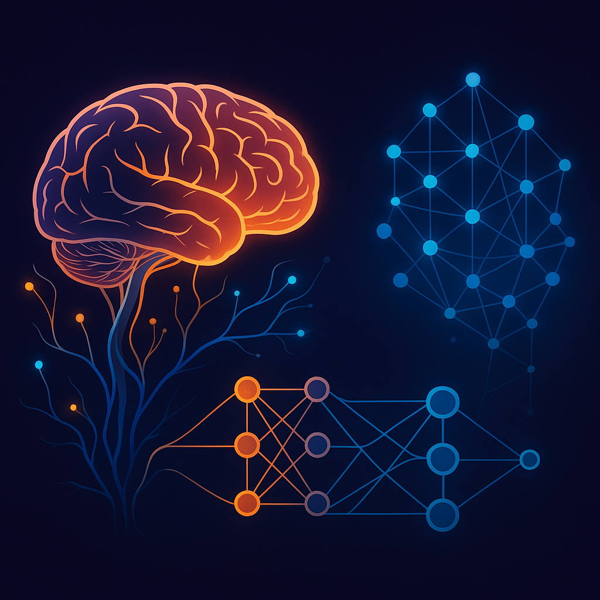

# 👋 Hi, I'm Prashanth Manga  
### 🎯 AI/ML Enthusiast | Future Innovator  
> “Designing intelligent systems that enhance human potential through data-driven insight.”

---

## 🔗 Quick Navigation  
[About Me](#about-me) | [Professional Bio](#professional-bio) | [Skills](#skills--interests) | [Featured Projects](#featured-projects) | [Testimonials](#testimonials) | [Contact](#connect-with-me)

---

## 🧠 About Me  

I’m **Prashanth Manga**, an aspiring **AI/ML Engineer** passionate about merging **data, algorithms, and ethics** to create intelligent systems that serve real-world impact.  
My vision is to build solutions that **enhance learning, improve decisions, and promote responsible AI** across industries.  

📫 **Email:** [mangaprashanth88@gmail.com](mailto:mangaprashanth88@gmail.com)  
🌐 **Portfolio:** [mangaprashanth.github.io](https://mangaprashanth.github.io)  
🐙 **GitHub:** [github.com/mangaprashanth](https://github.com/mangaprashanth)

---

## 💼 Professional Bio  

I am an **AI/ML Enthusiast** dedicated to exploring how data and intelligent systems can drive innovation.  
Through experimentation and collaboration, I aim to design **ethical, explainable, and data-driven** solutions that transform ideas into working prototypes.  
My projects demonstrate my ability to **analyze data**, **build models**, and **communicate complex concepts** clearly and visually.

---

## 🚀 Personal Value Proposition  

> “I bridge creativity and computation — transforming raw data into meaningful intelligence.”  

I combine technical depth with design thinking to build AI systems that are not only functional but **empathetic**, **transparent**, and **impact-focused**.

---

## 🛠️ Skills & Interests  

### 💻 Core Skills

| Skill | Proficiency |
|:------|:-------------|
| **Python** | ⭐⭐⭐⭐☆ |
| **SQL** | ⭐⭐⭐⭐☆ |
| **C++** | ⭐⭐⭐☆☆ |
| **Machine Learning (Scikit-Learn)** | ⭐⭐⭐⭐☆ |
| **Deep Learning (TensorFlow, PyTorch)** | ⭐⭐⭐⭐☆ |
| **Data Visualization (Matplotlib, Seaborn, Power BI)** | ⭐⭐⭐⭐☆ |
| **Cloud Tools (AWS, Google Colab)** | ⭐⭐⭐☆☆ |
| **Version Control (Git, GitHub)** | ⭐⭐⭐⭐☆ |

---

### 🌐 Areas of Interest  

- 🤖 **Generative AI & LLMs**  
- 🧠 **Reinforcement Learning**  
- ☁️ **Cloud-based AI Deployments**  
- 🧩 **AI Ethics & Explainability**

---

## 💡 Featured Projects  

### 🧩 1. Q/A Classroom Assistant Chatbot  

**Overview:**  
An **AI-powered educational chatbot** designed using the **Mizou platform** to provide syllabus-based Q&A assistance for students — focusing on clarity, empathy, and ethics.

**Challenges:**  
Balancing technical precision with user-friendly explanations while preventing model hallucinations.

**Solutions:**  
- Adopted the **Design Thinking process** (Empathize → Define → Ideate → Prototype → Test).  
- Built a closed-domain retrieval policy using structured course materials.  
- Integrated empathy-driven interaction guidelines.  

**Results:**  
- Improved clarity and trust in chatbot responses.  
- Achieved high accuracy in academic Q&A sessions.  

📘 **Documentation:**  
Follows a “materials-only” design rule based on *Introduction to Machine Learning with Python*.  

🔗 [**View Chatbot Project**](https://mizou.com/login-thread?ID=0qA7x3BspgrfLAlASJHQ6hKqxyOPLPFjxwL24nPA8KE-100723)

🖼️ **Demo Preview:**  
  
*Sample interaction showing the chatbot assisting students ethically and contextually.*

---

### 🤖 2. Machine Learning vs Deep Learning  

**Overview:**  
A conceptual and visual representation highlighting the **key distinctions between Machine Learning (ML) and Deep Learning (DL)**.

**Challenges:**  
Presenting complex AI differences simply and visually for non-technical audiences.

**Solutions:**  
- Designed an infographic comparing the workflows, algorithms, and learning styles.  
- Used relatable examples (spam detection vs image recognition).  
- Simplified the contrast through color-coded visual storytelling.  

🖼️ **Visual Comparison:**  
  
*Human-designed illustration comparing Machine Learning and Deep Learning.*

📄 **Summary:**  
| Aspect | Machine Learning | Deep Learning |
|:--------|:-----------------|:--------------|
| **Definition** | Algorithms learn from data using manual feature extraction. | Neural networks learn hierarchical representations automatically. |
| **Feature Engineering** | Manual | Automatic |
| **Data Requirement** | Moderate | High |
| **Complexity** | Shallow Models | Multi-layer Neural Networks |
| **Example Use Case** | Spam Detection | Image Recognition |

**Key Takeaway:**  
➡️ Deep Learning is a **subset of Machine Learning**, differing primarily in how it learns and represents data.

---

### 🤖 3. Deep Learning & Neural Networks  

**Overview:**  
An intuitive and comprehensive exploration of **Deep Learning and Neural Networks**, highlighting how machines learn hierarchical patterns, how neural architectures mimic human cognition, and why deep models excel in tasks like image recognition, speech processing, and sequential prediction. This work bridges biological learning principles with artificial neural computation, offering a clear foundation for understanding modern AI.  

**Challenges:**  
- High computational requirements for training deep models.  
- Large amounts of labeled data needed for accurate learning.  
- Difficulty interpreting deep models due to their “black box” nature.  
- Risk of overengineering—using deep learning where simple rules would suffice.  

**Solutions:**  
- Applied deep learning only to problems requiring high-dimensional pattern recognition.  
- Leveraged CNNs for image tasks, RNNs/LSTMs for sequence modeling, and feedforward networks for simpler patterns.  
- Utilized activation functions (ReLU, sigmoid, tanh) to introduce non-linearity and enable complex decision-making.  
- Employed hierarchical feature extraction to eliminate manual feature engineering.  
- Connected concepts to human brain processes using the Bayesian Brain Hypothesis for improved interpretability.  

🖼️ **Visual Comparison:**  
  
*Representation of human neurons vs artificial neural networks, showcasing layered processing and pattern recognition.*  

📄 **Summary:**  
| Concept | Description |
|:--------|:------------|
| **Neural Inspiration** | Mimics how the human brain recognizes patterns and updates predictions based on new information. |
| **Architectures Covered** | Feedforward Networks, CNNs, RNNs, LSTMs. |
| **Key Components** | Neurons, layers, weights, activation functions, hierarchical feature learning. |
| **Strengths** | Excellent for image, text, and complex pattern recognition; learns features automatically. |
| **Limitations** | Computationally expensive, requires large datasets, limited interpretability. |
| **Real-world Examples** | Disease detection via medical images, sequence modeling, visual pattern extraction. |

**Key Takeaway:**  
➡️ Deep Learning is most powerful when applied to **complex, high-dimensional pattern-recognition problems**, where it can outperform traditional ML through automatic feature learning and layered representation—but it must be used thoughtfully to avoid unnecessary complexity.

---

### 📊 4. Data Challenges in Machine Learning  

**Overview:**  
This artifact highlights the critical data-related challenges encountered when training and deploying machine learning models, based on the concepts learned this week and the accompanying quiz assessment. It summarizes how issues like poor data quality, noisy samples, low-quality labels, outliers, redundancy, and real-time data complexity directly influence the reliability, fairness, and performance of ML systems. The goal of this work is to demonstrate an understanding of how data imperfections propagate into model outcomes and why rigorous data handling practices are essential in real-world ML pipelines.

**Challenges:**  
- Outliers can distort distributions and mislead model training.  
- Monitoring data quality is essential because anomalies and data drift often go undetected without tooling.  
- Redundant or duplicated data increases bias and does not add meaningful signal.  
- Noisy data degrades model accuracy and reliability.  
- Low-quality labels directly produce misleading predictions and weaken overall performance.  
- Inconsistent data leads to unpredictable results and reduces trustworthiness.  
- Real-time data streams may be incomplete, noisy, or drifting, making preprocessing difficult.  
- Concepts like veracity, lineage, and integration become increasingly complex as datasets grow.  

**Solutions:**  
- Detect and handle outliers through filtering, robust statistics, or thresholding before training.  
- Use data quality monitoring tools to flag anomalies, inconsistencies, and drift early.  
- Deduplicate records to eliminate unnecessary bias and reduce training inefficiencies.  
- Apply smoothing, filtering algorithms, or noise-reduction techniques to clean messy data.  
- Improve label quality with validation checks, annotation guidelines, and consensus labeling.  
- Enforce consistency standards such as schema checks, format validation, and transformation logs.  
- Preprocess streaming or real-time data to handle missing values, noise, and shift in distributions.  
- Maintain veracity and lineage with documentation of origins, transformations, and dependencies.  

🖼️ **Visual Comparison:**  
   

📄 **Summary:**  
| Concept | Description |
|--------|-------------|
| **Outliers** | Skew model training, mislead algorithms, and distort statistical distributions. |
| **Data Monitoring** | Identifies anomalies, inconsistencies, and drift to maintain reliability. |
| **Redundancy** | Produces bias and inflates dataset size without adding new information. |
| **Noisy Data** | Requires filtering, smoothing, or outlier removal to stabilize models. |
| **Label Quality** | Low-quality labels cause misleading predictions and poor learning. |
| **Inconsistent Data** | Leads to unpredictable behavior and reduced model robustness. |
| **Real-Time Data Issues** | Often noisy, incomplete, and drifting, requiring extra preprocessing. |
| **Veracity** | Measures the trustworthiness, accuracy, and reliability of data. |
| **Data Lineage** | Tracks the origin, flow, and transformations applied to data. |

**Key Takeaway:**  
➡️ High-quality, consistent, and well-monitored data is the backbone of reliable machine learning systems. Addressing data challenges early—through cleaning, monitoring, validation, and documentation—dramatically improves a model's accuracy, fairness, and long-term usability.

---

## 💬 Testimonials  

> “Prashanth’s work is an impressive blend of technical understanding and ethical consideration — his chatbot design was both innovative and responsible.”  
> — *Professor A. Reynolds, AI & Design Thinking Instructor*

> “He consistently turns theory into practical applications — with clarity, creativity, and precision.”  
> — *Peer Reviewer, Mizou AI Cohort 2025*

---

## 🧭 Reflection  

Creating the **Chatbot** and **ML vs DL Comparison** projects deepened my understanding of both the **technical** and **human** sides of AI.  
I learned that true innovation lies in making complex ideas accessible — combining empathy, visualization, and ethical design principles.  

These experiences strengthened my ability to design **transparent, data-driven systems** that make learning interactive and meaningful.

---

## 🚀 Upcoming Projects  

- 🩺 **AI-Powered Health Insight Dashboard** *(in progress)*  
- 🤖 **Reinforcement Learning for Adaptive Tutoring Systems**  
- 🧠 **LLM Prompt Engineering Toolkit**  

---

## 📫 Connect With Me  

- 🌐 [Portfolio Website](https://mangaprashanth.github.io/)   
- 🐙 [GitHub](https://github.com/mangaprashanth)  
- ✉️ [Email](mailto:mangaprashanth88@gmail.com)

---

⭐ **“Keep learning, keep building, keep innovating.”**
